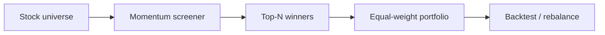

<p align="center">
  
</p>

<h1 align="center">Stock Trading Bot</h1>

<p align="center">
  <strong>AI stock trading bot — cross-sectional momentum ranking and portfolio rebalancing in Python.</strong><br>
  Rank a universe of stocks, hold the strongest, and rotate on a schedule — fully backtested.
</p>

<p align="center">
  <em>Built and maintained by <a href="https://viprasol.com">Viprasol Tech</a> — Fintech Experts. Full-Stack Builders.</em>
</p>

<p align="center">
  <a href="https://github.com/Viprasol-Tech/stock-trading-bot/actions/workflows/ci.yml"></a>
  <a href="LICENSE"></a>
  
  <a href="https://t.me/viprasol_help"></a>
  <a href="https://github.com/Viprasol-Tech/stock-trading-bot/stargazers"></a>
</p>

---

> ## ⚠️ Disclaimer
> This software is for **educational purposes only** and is **not financial advice**. Equity trading involves substantial risk, including the **loss of capital**. Backtest results are **not** indicative of future performance. Always validate on out-of-sample data and consult a licensed advisor. **Use at your own risk** — Viprasol Tech assumes no responsibility for your trading results.

---

## ✨ Features

- 🏆 **Cross-sectional momentum** — rank a universe by trailing return and hold the winners.
- 📊 **Configurable rotation** — choose top-N, lookback window, and rebalance cadence.
- 💼 **Equal-weight portfolio** — multi-symbol paper portfolio with automatic rebalancing.
- 🧪 **Backtester** — equity curve and total-return metrics across the universe.
- 🖥️ **CLI** — `stock-trading-bot demo --top-n 2` runs the whole strategy.
- ⚙️ **Modern tooling** — ruff, mypy (strict), pytest, GitHub Actions CI.

## 🚀 Quickstart

```bash
git clone https://github.com/Viprasol-Tech/stock-trading-bot.git
cd stock-trading-bot
python -m pip install -e ".[dev]"

stock-trading-bot demo --top-n 2
```

## 🧩 Use the screener

```python
from stock_trading_bot.screener import select_top

universe = {"AAPL": [...], "MSFT": [...], "NVDA": [...]}  # per-symbol price series
winners = select_top(universe, top_n=2, lookback=20)
```

## 🏗️ Architecture



## 🗺️ Roadmap

- [x] Momentum screener + equal-weight portfolio + rotation backtest
- [ ] Live data adapters (Alpaca, yfinance)
- [ ] Risk parity & volatility targeting
- [ ] Additional factors (value, quality, low-vol)

## 🤝 Contributing

PRs welcome — see [CONTRIBUTING.md](CONTRIBUTING.md) and our [Code of Conduct](CODE_OF_CONDUCT.md).

## 📬 Contact — Viprasol Tech Private Limited

- 🌐 Website: [viprasol.com](https://viprasol.com)
- ✉️ Email: [support@viprasol.com](mailto:support@viprasol.com)
- 💬 Telegram: [t.me/viprasol_help](https://t.me/viprasol_help) · 📱 WhatsApp: +91 96336 52112
- 🐙 GitHub: [@Viprasol-Tech](https://github.com/Viprasol-Tech) · 💼 [LinkedIn](https://www.linkedin.com/in/viprasol/) · 𝕏 [@viprasol](https://twitter.com/viprasol)

> *Viprasol Tech — fintech software, algorithmic trading systems, MT4/MT5 bots, AI voice agents, and B2B SaaS. Need a custom build? [Get in touch](mailto:support@viprasol.com).*

## 📄 License

[MIT](LICENSE) © 2025 Viprasol Tech Private Limited
