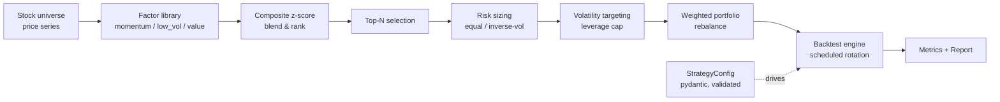

<p align="center">
  
</p>

<h1 align="center">Stock Trading Bot</h1>

<p align="center">
  <strong>A multi-factor, risk-aware equity rotation engine in pure Python.</strong><br>
  Blend momentum, low-volatility and value factors, size positions with risk parity,
  target portfolio volatility, and backtest it all with an institutional-grade report.
</p>

<p align="center">
  <em>Built and maintained by <a href="https://viprasol.com">Viprasol Tech</a> — Fintech Experts. Full-Stack Builders.</em>
</p>

<p align="center">
  <a href="https://github.com/Viprasol-Tech/stock-trading-bot/actions/workflows/ci.yml"></a>
  <a href="LICENSE"></a>
  
  
  
  
  <a href="https://t.me/viprasol_help"></a>
  <a href="https://github.com/Viprasol-Tech/stock-trading-bot/stargazers"></a>
</p>

---

> ## ⚠️ Disclaimer
> This software is for **educational and research purposes only** and is **not financial advice**. Equity trading involves substantial risk, including the **loss of capital**. Backtest results are simulated, ignore slippage, financing and taxes, and are **not** indicative of future performance. Always validate on out-of-sample data and consult a licensed advisor. **Use at your own risk** — Viprasol Tech assumes no responsibility for your trading results.

---

## ✨ Features

- 🧮 **Multi-factor scoring** — momentum, **low-volatility**, and a **value** (mean-reversion) factor, cross-sectionally z-scored and blended with custom weights.
- ⚖️ **Risk-parity sizing** — equal-weight *or* **inverse-volatility** weighting so every position contributes similar risk.
- 🎯 **Volatility targeting** — gear gross exposure up or down to hit an annualized vol target, with a hard leverage cap.
- 📅 **Rebalance schedules** — rotate **daily / weekly / monthly** with a single enum.
- 📊 **Institutional metrics** — CAGR, Sharpe, Sortino, max drawdown, Calmar, annualized vol, win rate.
- 🖨️ **Rich reports** — a clean metrics table plus an ASCII equity-curve sparkline, straight in your terminal.
- ⚙️ **Typed config** — a frozen, validated `pydantic` `StrategyConfig` is the single source of truth.
- 🖥️ **Real CLI** — `demo`, `backtest`, `rank`, and `version` subcommands.
- 🧪 **Tested & strict** — 87 tests, `ruff`, `mypy --strict`, GitHub Actions CI. No stubs, no TODOs.

## 🚀 Quickstart

```bash
git clone https://github.com/Viprasol-Tech/stock-trading-bot.git
cd stock-trading-bot
python -m pip install -e ".[dev]"

# Plain momentum demo
stock-trading-bot demo --top-n 2

# Multi-factor, risk-parity, vol-targeted, monthly rotation
stock-trading-bot backtest \
  --factors "momentum=1.0,low_vol=0.5" \
  --weighting inverse_vol \
  --schedule monthly \
  --target-vol 0.15

# Inspect the current composite ranking
stock-trading-bot rank --factors "momentum=1.0,value=0.5" --top-n 5
```

## 🧩 Usage

```python
from stock_trading_bot import StrategyConfig, run_strategy
from stock_trading_bot.config import RebalanceSchedule, WeightingScheme

# per-symbol price series (aligned, oldest -> newest)
universe = {
    "AAPL": [...],
    "MSFT": [...],
    "NVDA": [...],
}

config = StrategyConfig(
    top_n=3,
    lookback=21,
    factor_weights={"momentum": 1.0, "low_vol": 0.5},  # blended & z-scored
    weighting=WeightingScheme.INVERSE_VOL,             # risk parity
    schedule=RebalanceSchedule.MONTHLY,
    target_vol=0.15,                                   # 15% annualized target
)

result = run_strategy(universe, config)
report = result.metrics()

print(f"Total return : {result.total_return_pct:+.2f}%")
print(f"Sharpe       : {report.sharpe:.2f}")
print(f"Max drawdown : {report.max_drawdown * 100:.2f}%")
print(f"Rebalances   : {result.rebalances}")
```

See [`examples/factor_rotation.py`](examples/factor_rotation.py) for a full runnable script.

## 🏗️ Architecture



## 📚 Modules & API

| Module | What it gives you |
| --- | --- |
| `factors` | `momentum`, `low_volatility`, `value`, `composite_scores`, `rank_by_composite`, `select_top_composite` |
| `risk` | `equal_weight`, `inverse_vol_weight`, `portfolio_volatility`, `volatility_target_leverage` |
| `metrics` | `cagr`, `sharpe_ratio`, `sortino_ratio`, `max_drawdown`, `calmar_ratio`, `performance_report` |
| `config` | `StrategyConfig`, `WeightingScheme`, `RebalanceSchedule` (typed, validated) |
| `backtest` | `run_strategy`, `run_backtest`, `BacktestResult` |
| `portfolio` | `Portfolio.rebalance`, `Portfolio.rebalance_weighted` |
| `report` | `performance` table + `sparkline` + `render_report` |

## 🗺️ Roadmap

- [x] Cross-sectional momentum screener + equal-weight rotation backtest
- [x] Additional factors (low-volatility, value / mean-reversion) + composite blend
- [x] Risk-parity (inverse-vol) sizing & portfolio volatility targeting
- [x] Performance report (Sharpe, Sortino, drawdown, Calmar) + rebalance schedules + CLI
- [ ] Live data adapters (Alpaca, yfinance)
- [ ] Transaction costs & slippage modelling
- [ ] Covariance-aware risk parity (full correlation matrix)

## ❓ FAQ

**Does it place real trades?** No. It is a research/backtesting engine with a paper `Portfolio`. Wiring a broker adapter is on the roadmap.

**Why a "value" factor without fundamentals?** With only price data, `value` is implemented as a mean-reversion proxy (distance below the moving average) — a well-studied short-horizon reversal signal. Swap in fundamental ratios when you have them.

**Do I need numpy/pandas?** No. The core is pure Python and depends only on `pydantic`, `typer`, and `rich`.

**How do I add my own factor?** Write a `(prices, lookback) -> float` function and register it in `factors.FACTOR_FUNCS`; it is immediately usable in any composite blend and in the CLI.

## 🤝 Contributing

PRs welcome — see [CONTRIBUTING.md](CONTRIBUTING.md) and our [Code of Conduct](CODE_OF_CONDUCT.md). Please run `ruff check .`, `mypy src`, and `pytest` before opening a PR.

## Contact — Viprasol Tech Private Limited

- Website: [viprasol.com](https://viprasol.com)
- Email: [support@viprasol.com](mailto:support@viprasol.com)
- Telegram: [t.me/viprasol_help](https://t.me/viprasol_help) | WhatsApp: +91 96336 52112
- GitHub: [@Viprasol-Tech](https://github.com/Viprasol-Tech) | [LinkedIn](https://www.linkedin.com/in/viprasol/) | X [@viprasol](https://twitter.com/viprasol)

> *Viprasol Tech — fintech software, algorithmic trading systems, MT4/MT5 bots, AI voice agents, and B2B SaaS. Need a custom build? [Get in touch](mailto:support@viprasol.com).*

## License

[MIT](LICENSE) (c) 2025 Viprasol Tech Private Limited
